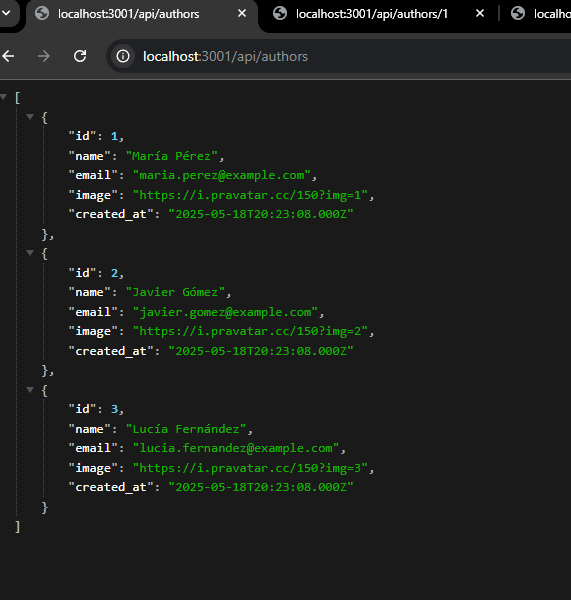
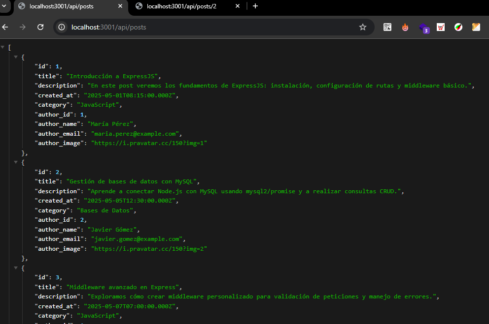
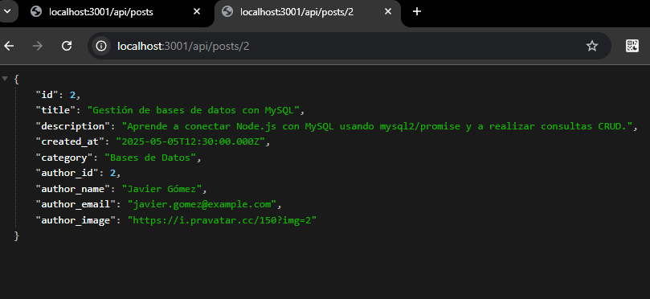
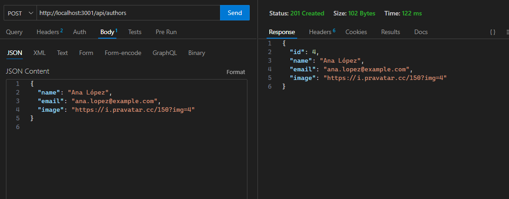
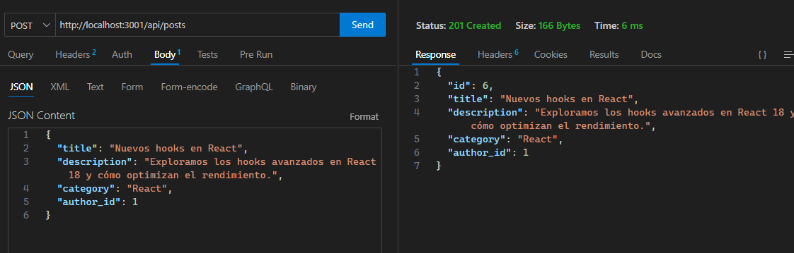

# Blog API

API RESTful para la gestión de autores y posts de un blog, desarrollada con Node.js, Express y MySQL.


## Características

- CRUD de autores y posts
- Relación entre autores y posts
- Respuestas en formato JSON
- Paginación para recursos (en endpoints de restaurantes)
- Manejo de errores y rutas no encontradas
- Separación de rutas y controladores

## Endpoints principales

### Autores

- `GET /api/authors`  
  Lista todos los autores

- `GET /api/authors/:id`  
  Obtiene un autor por ID

- `POST /api/authors`  
  Crea un nuevo autor (`name`, `email`, `image`)

- `GET /api/authors/:id/posts`  
  Lista los posts de un autor

### Posts

- `GET /api/posts`  
  Lista todos los posts con datos de autor

- `GET /api/posts/:id`  
  Obtiene un post por ID

- `POST /api/posts`  
  Crea un nuevo post (`title`, `description`, `category`, `author_id`)

## Instalación

1. Clona el repositorio
2. Instala dependencias:

   ```sh
   npm install
   ```

3. Configura las variables de entorno en un archivo `.env`:

   ```
   DB_HOST=localhost
   DB_USER=tu_usuario
   DB_PASSWORD=tu_contraseña
   DB_NAME=blogdb
   DB_PORT=3306
   PORT=3001
   ```

4. Crea la base de datos y las tablas ejecutando el script [`schema.sql`](schema.sql).

5. Inicia el servidor:

   ```sh
   npm run dev
   ```

## Pruebas de la API

Puedes usar el archivo [`peticiones.rest`](peticiones.rest) con la extensión "REST Client" de VS Code para probar los endpoints.

## Documentación detallada de endpoints

### 🧑‍💻 Autores

#### 🔹 Obtener todos los autores
**GET**
```bash
http://localhost:3001/api/authors
```

#### 🔹 Obtener un autor por ID
**GET**
```bash
http://localhost:3001/api/authors/1
```

#### 🔹 Crear un nuevo autor
**POST**
```bash
http://localhost:3001/api/authors
```
**Body (JSON)**
```json
{
  "name": "Ana López",
  "email": "ana.lopez@example.com",
  "image": "https://i.pravatar.cc/150?img=4"
}
```

#### 🔹 Obtener los posts de un autor
**GET**
```bash
http://localhost:3001/api/authors/1/posts
```

### 📝 Posts

#### 🔹 Obtener todos los posts con sus autores
**GET**
```bash
http://localhost:3001/api/posts
```

#### 🔹 Obtener un post por ID
**GET**
```bash
http://localhost:3001/api/posts/2
```

#### 🔹 Crear un nuevo post
**POST**
```bash
http://localhost:3001/api/posts
```
**Body (JSON)**
```json
{
  "title": "Nuevos hooks en React",
  "description": "Exploramos los hooks avanzados en React 18 y cómo optimizan el rendimiento.",
  "category": "React",
  "author_id": 1
}
```

## Ejemplos de uso

### Todos los autores


### Todos los posts


### Autor por ID


### Post por ID


### Nuevo Autor


### Nuevo Post


### Posts de un autor


## Estructura del proyecto

- `server.js` — Punto de entrada principal
- `routes/` — Rutas de autores y posts
- `controllers/` — Lógica de negocio de autores y posts
- `schema.sql` — Script de creación de la base de datos y datos de ejemplo

## Tecnologías utilizadas

- Node.js
- Express.js
- MySQL
- dotenv
- mysql2
- nodemon

---

📌 Proyecto desarrollado por **Rodrigo Sendino Sanz**

## Licencia

MIT
